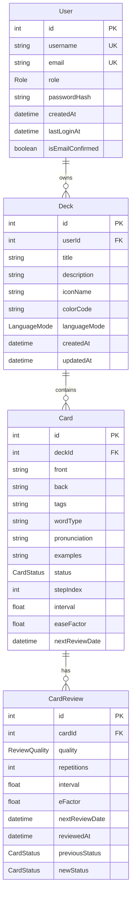
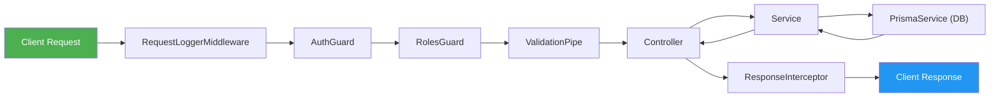
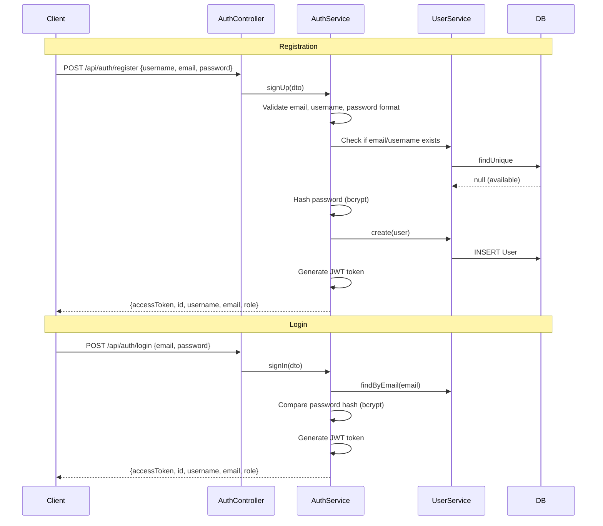
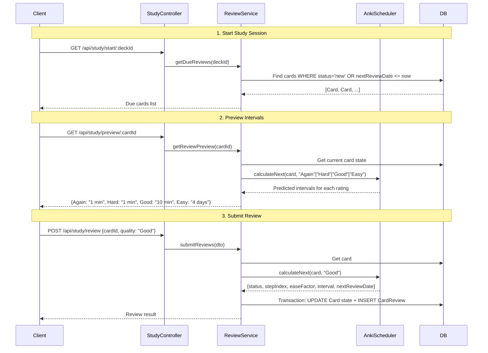
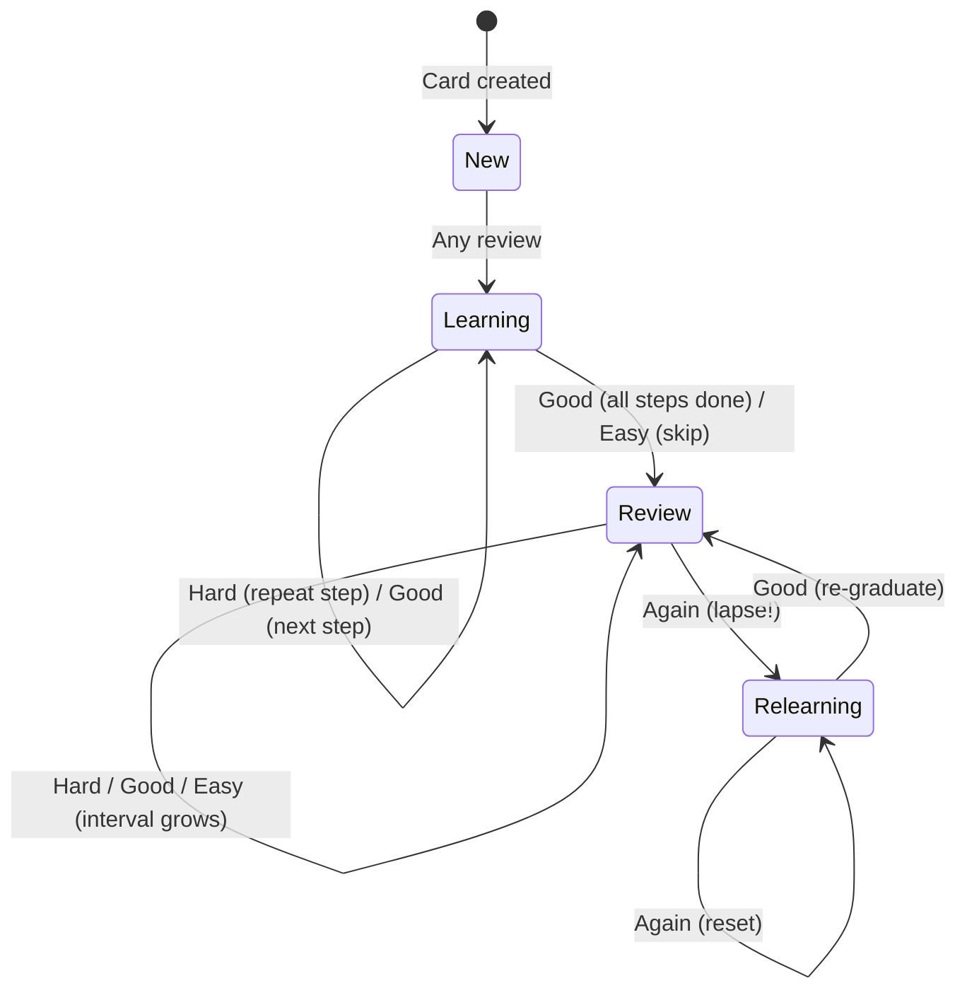

# FlashLearn Backend — New Employee Onboarding Guide

Welcome to the FlashLearn Backend team! This document will walk you through the project architecture, database models, request lifecycle, and the core business flows so you can start contributing quickly.

---

## 1. Project Overview

FlashLearn is a **spaced-repetition flashcard application** inspired by Anki. It uses the **SM-2 (SuperMemo 2) Algorithm** to intelligently schedule when a user should review each flashcard to maximize long-term memory retention.

### Tech Stack

| Layer          | Technology                  |
| -------------- | --------------------------- |
| Framework      | NestJS (TypeScript)         |
| ORM / Database | Prisma ORM + SQLite         |
| Authentication | JWT (JSON Web Tokens)       |
| API Docs       | Swagger / OpenAPI (auto-generated) |
| Testing        | Jest (Unit & E2E)           |
| Scheduling     | `@nestjs/schedule` (Cron)   |

---

## 2. Directory Structure

```
src/
├── main.ts                     # Application entry point (bootstrap, Swagger, CORS)
├── app.module.ts               # Root module – wires everything together
├── app.controller.ts           # Health-check / root controller
├── app.service.ts
│
├── controllers/                # Handle HTTP requests & return responses
│   ├── auth/                   #   POST /auth/register, /auth/login
│   ├── card/                   #   CRUD for flashcards
│   ├── deck/                   #   CRUD for decks + statistics
│   ├── study/                  #   Study sessions, reviews, cram mode, statistics
│   └── user/                   #   User profile management
│
├── services/                   # Core business logic & data access
│   ├── auth/                   #   Sign up / sign in logic
│   ├── card/                   #   Card CRUD + statistics
│   ├── deck/                   #   Deck CRUD + statistics
│   ├── review/                 #   Submit reviews, SM-2 scheduling
│   ├── study/                  #   Session stats, cram mode, user analytics
│   ├── user/                   #   User CRUD
│   ├── email/                  #   Email sending (Nodemailer)
│   ├── email-verification/     #   Email confirmation flow
│   ├── prisma.service.ts       #   Prisma client wrapper (DB connection)
│   └── scheduler.ts            #   ★ AnkiScheduler – the SM-2 algorithm engine
│
├── modules/                    # NestJS modules that wire controllers ↔ services
│   ├── auth.module.ts
│   ├── card.module.ts
│   ├── deck.module.ts
│   ├── study.module.ts
│   ├── user.module.ts
│   └── prisma.module.ts
│
├── middleware/
│   ├── guards/
│   │   ├── auth.guard.ts       # JWT token verification (per-route)
│   │   └── roles.guard.ts      # Role-based access control (USER / ADMIN)
│   ├── interceptor/
│   │   ├── response.interceptor.ts   # Wraps all responses in ApiResponseDto
│   │   └── requestLog.interceptor.ts # Logs incoming requests
│   └── filters/
│       └── global.filter.ts    # Catches all exceptions → standardized error JSON
│
├── utils/
│   ├── constants.ts            # bcrypt salt rounds, JWT secret
│   ├── decorators/
│   │   ├── route.decorator.ts  # @RouteConfig – sets auth, roles, message metadata
│   │   └── user.decorator.ts   # @GetUser – extracts user from request
│   └── types/
│       └── dto/                # Data Transfer Objects (validation & shape)
│
prisma/
└── schema.prisma               # Database schema definition

tests/
├── unit/                       # Unit tests
└── e2e/                        # End-to-end tests (including SM-2 algorithm tests)
```

---

## 3. Database Schema (Entity Relationship)



### Key Enums

| Enum            | Values                                    | Purpose                        |
| --------------- | ----------------------------------------- | ------------------------------ |
| `Role`          | `USER`, `ADMIN`                           | User access level              |
| `CardStatus`    | `new`, `learning`, `review`, `relearning` | Card's position in SM-2 cycle  |
| `ReviewQuality` | `Again`, `Hard`, `Good`, `Easy`           | User's self-assessment rating  |
| `LanguageMode`  | `VN_EN`, `EN_VN`, `BIDIRECTIONAL`         | Deck translation direction     |

---

## 4. Request Lifecycle (How a Request Flows)

Every HTTP request goes through the following pipeline before reaching your controller:



### Step-by-step:

1. **RequestLoggerMiddleware** — Logs every incoming request (method, URL).
2. **AuthGuard** — Checks if the route has `requiresAuth: true` via `@RouteConfig`. If yes, extracts the JWT from the `Authorization: Bearer <token>` header, verifies it, looks up the user in the DB, and attaches the `User` object to `request['user']`.
3. **RolesGuard** — If the route specifies `roles: ['ADMIN']`, checks the user's role. Returns 403 if unauthorized.
4. **ValidationPipe** — Automatically validates and transforms the request body/query against DTO classes (using `class-validator` decorators). Rejects invalid data with 400.
5. **Controller** — Receives the validated request, calls the appropriate service method.
6. **Service** — Executes business logic, queries the database via `PrismaService`.
7. **ResponseInterceptor** — Wraps the returned data into a standardized `ApiResponseDto`:
   ```json
   {
     "statusCode": 200,
     "message": "Get All Decks By User",
     "data": { ... },
     "timestamp": "2026-05-05T09:00:00.000Z",
     "path": "/api/deck"
   }
   ```
8. **GlobalExceptionFilter** — If any error is thrown at any stage, it catches it and returns a consistent error response with the same `ApiResponseDto` shape.

---

## 5. Core Business Flows

### 5.1 Authentication Flow



**Key points:**
- Passwords are hashed with **bcrypt** before storage.
- The JWT payload contains `{ id, username }`.
- All subsequent requests must include `Authorization: Bearer <token>`.

---

### 5.2 Deck & Card Management Flow

This is straightforward **CRUD**:

| Action         | Endpoint                    | Description                            |
| -------------- | --------------------------- | -------------------------------------- |
| Create Deck    | `POST /api/deck`            | Creates a deck for the logged-in user  |
| List My Decks  | `GET /api/deck`             | Returns all decks owned by the user    |
| Get Deck       | `GET /api/deck/:id`         | Returns a single deck (with ownership check) |
| Update Deck    | `PATCH /api/deck/:id`       | Update title, description, icon, color |
| Delete Deck    | `DELETE /api/deck/:id`      | Cascades to delete all cards & reviews |
| Create Card    | `POST /api/card`            | Add a flashcard to a deck              |
| List Cards     | `GET /api/card?deckId=X`    | List cards, optionally by deck         |
| Update Card    | `PATCH /api/card/:id`       | Edit front/back text, tags, etc.       |
| Delete Card    | `DELETE /api/card/:id`      | Cascades to delete all reviews         |

**Card fields include:** `front`, `back`, `tags`, `wordType`, `pronunciation`, `examples` (JSON array).

---

### 5.3 Study & Review Flow (★ Core Feature)

This is the heart of the application — the **spaced-repetition study loop**.



---

### 5.4 The SM-2 Algorithm (AnkiScheduler)

The algorithm is implemented in `src/services/scheduler.ts` as the `AnkiScheduler` class. Here is how a card moves through the system:



#### Default Settings

| Setting              | Value     | Meaning                              |
| -------------------- | --------- | ------------------------------------ |
| `learningSteps`      | `[1, 10]` | 1 min, then 10 min                  |
| `relearningSteps`    | `[10]`    | 10 min after a lapse                |
| `graduatingInterval` | `1 day`   | First review interval after learning |
| `easyInterval`       | `4 days`  | Skip directly to 4 days             |
| `startingEase`       | `2.5`     | Default ease factor multiplier       |
| `minEase`            | `1.3`     | Ease factor floor                    |
| `hardIntervalFactor` | `1.2`     | Multiplier for "Hard" in review      |
| `easyBonus`          | `1.3`     | Extra multiplier for "Easy"          |

#### Example Walkthrough

1. **New card** → User rates **Good** → Moves to Learning Step 1 (10 min)
2. **Learning Step 1** → User rates **Good** → Graduates to Review (interval = 1 day)
3. **Review** (interval = 1 day, EF = 2.5) → User rates **Good** → interval = 1 × 2.5 = **2.5 days**
4. **Review** (interval = 2.5 days) → User rates **Again** → Lapse! Goes to **Relearning** (10 min), EF drops to 2.3

---

### 5.5 Cram Mode Flow

Cram mode lets users practice cards **without affecting the spaced-repetition schedule**.

| Endpoint                        | Description                                      |
| ------------------------------- | ------------------------------------------------ |
| `GET /api/study/cram/:deckId`   | Get shuffled cards for practice (ignores schedule)|
| `POST /api/study/cram/review`   | Submit a cram review (recorded but no reschedule) |

Cram reviews are saved to `CardReview` (so they count toward study streaks and statistics) but the `Card` table's scheduling fields (`status`, `interval`, `easeFactor`, `nextReviewDate`) are **NOT updated**.

---

### 5.6 Statistics & Analytics

The application provides multiple levels of statistics:

| Endpoint                                     | Scope        | Returns                                            |
| -------------------------------------------- | ------------ | -------------------------------------------------- |
| `GET /api/study/user-statistics`             | User-wide    | Total reviews, streak, accuracy across all decks    |
| `GET /api/study/user-daily-breakdown`        | User-wide    | Day-by-day review counts for a date range           |
| `GET /api/study/recent-activity`             | User-wide    | Latest N study activities                           |
| `GET /api/study/consecutive-days/:deckId`    | Per deck     | Current study streak (consecutive days)             |
| `GET /api/study/session-statistics/:deckId`  | Per session  | Cards reviewed, accuracy for a time window          |
| `GET /api/study/time-range-statistics/:deckId`| Per deck    | Detailed breakdown with daily data                  |
| `GET /api/deck/:id/statistics`               | Per deck     | Correct %, card status distribution                 |
| `GET /api/deck/:id/advanced-statistics`      | Per deck     | Retention rate, maturity, interval distribution     |
| `GET /api/card/:id/statistics`               | Per card     | Review history, ease factor trend                   |

---

## 6. Key Patterns & Conventions

### `@RouteConfig` Decorator
Every controller method uses `@RouteConfig` to declare:
- `message` — Human-readable label (used in the standardized API response).
- `requiresAuth` — Whether `AuthGuard` should enforce JWT verification.
- `roles` — Optional array (`['ADMIN']`) for role-based restrictions.

```typescript
@RouteConfig({
  message: 'Get All Decks By User',
  requiresAuth: true,
  roles: ['ADMIN'],  // optional
})
```

### Standardized API Response
**All** responses follow this shape (enforced by `ResponseInterceptor` and `GlobalExceptionFilter`):

```typescript
// Success
{ statusCode: 200, message: "Get All Decks By User", data: [...], timestamp: "...", path: "/api/deck" }

// Error
{ statusCode: 404, message: "Deck not found", data: null, timestamp: "...", path: "/api/deck/999" }
```

### DTOs (Data Transfer Objects)
Located in `src/utils/types/dto/`. They serve three purposes:
1. **Validate** incoming requests (via `class-validator` decorators).
2. **Transform** raw data into the expected shape.
3. **Generate** Swagger documentation automatically.

### No Separate Repository Layer
This project does **not** use a Repository pattern. Services inject `PrismaService` directly and perform database queries inline. All data access logic lives in the service files.

---

## 7. Getting Started

### Prerequisites
- Node.js (v18+)
- npm or pnpm

### Setup

```bash
# 1. Install dependencies
npm install

# 2. Copy environment variables
cp .env.sample .env
# Edit .env with your DATABASE_URL and JWT_SECRET

# 3. Generate Prisma client
npx prisma generate

# 4. Run database migrations
npx prisma migrate dev

# 5. (Optional) Seed the database
npm run seed

# 6. Start the dev server
npm run start:dev
```

### Useful Commands

| Command                | Description                            |
| ---------------------- | -------------------------------------- |
| `npm run start:dev`    | Start in watch mode                    |
| `npm run build`        | Compile TypeScript to JavaScript       |
| `npm run test`         | Run unit tests                         |
| `npm run test:e2e`     | Run end-to-end tests                   |
| `npx prisma studio`   | Open Prisma Studio (visual DB browser) |
| `npx prisma migrate dev` | Apply pending migrations            |

### API Documentation
Once the server is running, visit **http://localhost:3000/api** to access the auto-generated Swagger UI.

---

## 8. Quick Reference: File → Responsibility Map

| If you need to change…                  | Look at…                              |
| ---------------------------------------- | ------------------------------------- |
| How a user logs in / registers           | `services/auth/auth.service.ts`       |
| How cards are created / updated          | `services/card/card.service.ts`       |
| How decks are managed                    | `services/deck/deck.service.ts`       |
| The SM-2 scheduling algorithm            | `services/scheduler.ts`              |
| How reviews are submitted & processed    | `services/review/review.service.ts`   |
| Study session stats / cram mode          | `services/study/study.service.ts`     |
| JWT authentication logic                 | `middleware/guards/auth.guard.ts`     |
| Role-based access control                | `middleware/guards/roles.guard.ts`    |
| Standardized response wrapping           | `middleware/interceptor/response.interceptor.ts` |
| Error handling                           | `middleware/filters/global.filter.ts` |
| Database schema / migrations             | `prisma/schema.prisma`               |
| Request validation shapes                | `utils/types/dto/`                    |
| Route metadata (auth, roles, message)    | `utils/decorators/route.decorator.ts` |

---

> **Tip:** When in doubt about any API endpoint, start with the corresponding controller file in `src/controllers/`, then trace the call into its service in `src/services/`. The code is organized to read top-down: **Controller → Service → Prisma (DB)**.

Happy coding! 🚀
